**Autor:** Brayan Alpizar Elizondo  
**Asignatura:** Arquitectura de Computadores 1  
**Carrera:** Ingeniería en Computadores - 2026


# Arquitectura de la Capa C

La capa C del proyecto se centra en **gestionar los datos de entrada y salida, preparar los buffers para la criptografía y coordinar la ejecución del algoritmo ChaCha20 implementado en ensamblador**. C no realiza operaciones criptográficas directamente; todas estas se delegan a funciones ASM. Su diseño sigue principios de **separación de responsabilidades, modularidad y trazabilidad**.

----------

## 1. Gestión de datos y buffers

C define y almacena todos los elementos esenciales para la operación del cifrado:

-   **Clave (key[8])**: 256 bits divididos en 8 palabras de 32 bits.
    
-   **Nonce (nonce[3])**: 96 bits divididos en 3 palabras de 32 bits.
    
-   **Contador (counter)**: palabra de 32 bits, que se incrementa por cada bloque.
    
-   **Plaintext y ciphertext**:
    
    -   `message_1`, `message_2`, `message_3` → mensajes de prueba.
        
    -   `encrypted_message`, `encrypted_message_2`, `encrypted_message_3` → buffers de salida cifrada.
        
-   **Buffers de estado y keystream**:
    
    -   `cyphered_block[64]` → bloque de 64 bytes generado por ASM.
        
    -   `keystream`, `keystream_2`,`keystream_3` → secuencia de bytes de keystream generada.
        
    -   `blocks`, `blocks_2`, `blocks_3` → estados internos de ChaCha20 almacenados palabra por palabra (16 palabras por bloque).
        

Estos buffers permiten **almacenar y recuperar datos bloque por bloque**, facilitando la impresión, depuración y verificación con vectores de prueba.

----------

## 2. Funciones auxiliares de C

Para mostrar resultados y realizar trazabilidad, se implementan funciones de impresión y conversión:

-   `print_char(char c)` → imprime un carácter (por ejemplo, a UART en un entorno bare-metal).
    
-   `print_string(const char *str)` → imprime cadenas de caracteres.
    
-   `print_hex_byte(unsigned char b)` → imprime un byte en formato hexadecimal.
    
-   `print_hex_uint32(uint32_t x)` → imprime un valor de 32 bits en hexadecimal.
    
-   `print_block(unsigned char *block, unsigned int length)` → imprime un bloque de bytes en formato hexadecimal con columna ASCII.
    
-   `print_blocks(int message_len, uint32_t *blocks)` → imprime los bloques internos de 16 palabras.
    
-   `print_keystream(int message_len, unsigned char *keystream)` → imprime los bytes del keystream separados por `:`.
    

Estas funciones permiten **visualizar tanto los datos cifrados como los estados internos**, facilitando la verificación de la implementación.

----------

## 3. Interfaces externas hacia ASM

C define las funciones externas de ensamblador que realizan la operación criptográfica:

```C
extern  void  quarter_round_c(uint32_t*  a, uint32_t*  b, uint32_t*  c, uint32_t*  d);  
extern  void  chacha20_encrypt(  
  uint32_t  *key,  
  uint32_t  *counter,  
  uint32_t  *nonce,  
  unsigned  char  *plaintext,  
  unsigned  int  length  
);
```
-   `quarter_round_c` → ejecuta una ronda de ChaCha20 sobre 4 palabras (usada para pruebas unitarias y verificación de RFC).
    
-   `chacha20_encrypt` → cifra o descifra un mensaje completo usando ChaCha20.
    

C prepara los parámetros, llama a ASM y maneja la salida en buffers globales.

----------

## 4. Funciones C llamadas desde ASM

C también provee funciones que ASM puede invocar para manejar la salida y guardar estados:

-   `save_serialized(unsigned char *block)` → guarda bloques de keystream generados.
    
-   `save_state(uint32_t *state)` → almacena el estado interno de ChaCha20 (16 palabras) en buffers de bloques.
    
-   `print_block(unsigned char *block, unsigned int length)` → imprime bloques de 64 bytes en hexadecimal.
    

Esto permite que ASM **no tenga que manejar I/O ni buffers complejos**, manteniendo la lógica criptográfica separada de la gestión de datos.

----------


## 5. Flujo de ejecución en C

1.  **Inicialización de datos:**  
    C define claves (`key`), nonce (`nonce`), contador (`counter`) y mensajes de prueba (`message_1`, `message_2`). Estos datos se inicializan al inicio del `main` y pueden **modificarse para diferentes vectores de prueba**, permitiendo ejecutar distintos escenarios de cifrado sin tocar ASM.
    
2.  **Control de bloques y estado global:**  
    Se utiliza la variable global `encrypted_index` para **llevar el registro del byte actual dentro de la secuencia de bloques cifrados**. Esto permite que las funciones de C y ASM sepan en qué posición del mensaje se está trabajando y a qué bloque corresponde cada operación de keystream o almacenamiento de estado (`save_state` / `save_serialized`).  
    Antes de cada prueba, `encrypted_index` se resetea a 0 para comenzar desde el primer bloque.
    
3.  **Prueba de `quarter_round_c`:**
    
    -   C imprime los valores originales de un vector de prueba.
        
    -   Llama a `quarter_round_c` implementada en ASM.
        
    -   Imprime los resultados para verificar que coincidan con los valores esperados según RFC.
        
4.  **Cifrado de mensajes:**
    
    -   C llama a `chacha20_encrypt` con los buffers adecuados, incluyendo `key`, `counter`, `nonce` y el mensaje.
        
    -   La función ASM genera el keystream y lo devuelve a C mediante los buffers globales (`cyphered_block`, `keystream`, `blocks`).
        
    -   C almacena el bloque resultante y actualiza `encrypted_index` para el siguiente bloque.
        
5.  **Desencriptación:**
    
    -   Se vuelve a llamar a `chacha20_encrypt` usando el ciphertext generado y la misma clave/nonce para recuperar el texto original.
        
    -   `encrypted_index` se resetea nuevamente a 0 para asegurar que los bloques se procesen desde el inicio.
        
6.  **Depuración y salida:**
    
    -   Se imprimen los bloques internos (`blocks`) y los bytes del keystream (`keystream`) para verificar el funcionamiento correcto.
        
    -   Cada bloque se procesa de manera independiente, lo que permite inspeccionar paso a paso los resultados de ChaCha20.

# Arquitectura de la Capa ASM


### Estructura de memoria

El archivo ASM define claramente las áreas de memoria utilizadas, todas en la sección `.data`:

-   **Constantes de ChaCha20** (`original_constants`): las primeras 4 palabras del estado, corresponden a `"expand 32-byte k"`.
    
-   **Estado principal** (`state`): 16 palabras (512 bits), combinando constantes, clave, contador y nonce.
    
-   **Working state** (`working_state`): copia temporal del estado durante los 20 rounds.
    
-   **Bloque serializado** (`serialized_block`): resultado final de 64 bytes por cada bloque, listo para XOR con el plaintext.
    
-   **Bloque cifrado** (`cyphered_block`): almacena temporalmente el resultado de la XOR entre keystream y plaintext.
    

Esta definición explícita permite que ASM acceda de manera eficiente a memoria y facilita la modularidad entre los distintos componentes.

----------

### Manejo de stack y convenciones ABI

-   Se siguió la **convención ABI de RISC-V**, utilizando los registros `a0-a7` para pasar parámetros y `s0-s11` para registros callee-saved.
    
-   Antes de llamar a cualquier función, el código **reserva espacio en el stack** para:
    
    -   Dirección de retorno (`ra`).
        
    -   Valores de registros `s` que se usan como punteros o índices dentro de bucles (`s0-s8`).
        
-   Esto permite que los registros temporales (`t0-t6`) se utilicen libremente dentro de funciones como `quarter_round`, `inner_block` o `encrypt_message` sin perder información crítica.
    

----------

### Modularidad y organización de archivos

El código ASM se separó en archivos y componentes claros siguiendo la especificación oficial de ChaCha20:

1.  **Quarter Round (`quarter_round`)**: implementa las sumas, XOR y rotaciones de 4 palabras del estado.
    
2.  **Inner Block (`inner_block`)**: aplica 8 quarter rounds por bloque, diferenciando **column rounds** y **diagonal rounds**.
    
3.  **ChaCha20 Block (`chacha20_block`)**: copia el estado original a `working_state`, ejecuta 10 inner blocks (20 rounds) y suma el resultado al estado original.
    
4.  **ChaCha20 Encrypt (`chacha20_encrypt`)**: divide el mensaje en bloques de 64 bytes, genera el keystream y realiza la XOR con el plaintext.
    

El enfoque modular permite que cada archivo se centre en **una función específica del algoritmo**, evitando un único archivo masivo y facilitando depuración y mantenimiento.

----------

### Mapeo del estado a registros RISC-V

| Palabra del estado | Registro RISC-V | Uso |
|------------------|----------------|-----|
| `state[x]`       | `t3`           | Primera palabra del quarter round, combinada con `t6` en rotaciones. |
| `state[y]`       | `t4`           | Segunda palabra, utilizada en operaciones XOR y suma. |
| `state[z]`       | `t5`           | Tercera palabra, combinada con `t6` y `t3`. |
| `state[w]`       | `t6`           | Cuarta palabra, usada en rotaciones y XOR. |
| Punteros a palabras | `s1-s4`       | Direcciones de memoria de `x, y, z, w`, usadas para acceder y actualizar el estado. |

Direcciones de memoria de `x, y, z, w`, usadas para acceder y actualizar el estado.

Este mapeo permite:

-   Minimizar accesos a memoria cargando palabras directamente en registros temporales (`t3-t6`).
    
-   Mantener la integridad del estado original mientras se manipula `working_state`.
    
-   Preparar de manera eficiente los parámetros para `quarter_round` y `inner_block`.
    

----------

### Manejo de bloques y buffers

-   Cada bloque de 64 bytes se procesa **individualmente** en ASM.
    
-   Tras generarse el keystream, se realiza la XOR con el plaintext y el resultado se guarda en `cyphered_block`.
    
-   Luego, se llama a C (`print_block`) para imprimir el bloque. Esto evita manejar buffers grandes directamente en ASM y permite depuración más sencilla.
    
-   El manejo de **bloques parciales** se contempla para el último bloque si el mensaje no es múltiplo de 64 bytes.
   
### Modos de direccionamiento en la implementación ASM de ChaCha20  
  
En la implementación en RISC-V ASM del algoritmo ChaCha20 se utilizan varios modos de direccionamiento, cada uno adaptado a necesidades específicas del algoritmo y del manejo de memoria.  
  
### 1. Direccionamiento relativo al stack

Este modo se utiliza principalmente para **guardar y restaurar registros** y la dirección de retorno antes y después de llamar a funciones. Permite preservar el estado de los registros *callee-saved* y manejar correctamente las llamadas a funciones dentro del código modular.

### 2. Direccionamiento directo a memoria

Se emplea para acceder a **constantes globales, buffers y estados** definidos en la sección de datos. Este modo permite leer y escribir palabras específicas en arreglos conocidos, como las constantes de ChaCha20 o el estado principal, usando desplazamientos fijos dentro de bloques de memoria predefinidos.

### 3. Direccionamiento basado en registros

Se utiliza para manipular bloques de memoria cuya dirección base se almacena en un registro. Es útil para **copiar o actualizar bloques de 16 palabras** (como el estado de trabajo) y permite operaciones dinámicas sin depender de posiciones fijas en memoria.

### 4. Desplazamiento inmediato

Se aplica cuando se conoce la posición relativa de un elemento dentro de un arreglo de palabras de 32 bits. Permite acceder directamente a cada palabra de clave, nonce o estado sin necesidad de cálculos adicionales de punteros, facilitando la inicialización y actualización de bloques.

### 5. Acceso secuencial mediante loops

Se combina el direccionamiento basado en registros con incrementos automáticos de puntero dentro de ciclos. Este modo permite procesar bloques completos de memoria de forma eficiente, recorriendo arreglos de estado o serializando resultados de manera ordenada.

----------

### Detalles adicionales destacados

-   Los **loops en ASM** (`xor_loop`, `serialize_loop`, `copy_loop`) están optimizados usando registros temporales y contadores en el stack.
    
-   Funciones auxiliares como `rotate_left` encapsulan operaciones repetitivas, aumentando la **legibilidad y modularidad**.

# Justificacion del diseño

La implementación del algoritmo **ChaCha20** en RISC-V Assembly se estructuró con un enfoque claro en **separación de responsabilidades, modularidad y compatibilidad con C**, buscando al mismo tiempo claridad y facilidad de depuración.

#### Separación de responsabilidades entre ASM y C

Se decidió que ASM manejara únicamente la **generación de bloques, manipulación del estado y la operación XOR con el plaintext**, mientras que C se encargara de la **impresión y almacenamiento de los bloques**. Esta decisión se tomó porque **mezclar llamadas frecuentes entre C y ASM complica la depuración**, ya que cada llamada requiere preparar los registros de parámetros (`a0–a7`) y valores de retorno. Al mantener la lógica de cifrado íntegramente en ASM, se simplifica el flujo del programa y se reduce la probabilidad de errores al depurar, al mismo tiempo que se mantiene la interoperabilidad con C para funciones de salida y almacenamiento de resultados.

### Uso del stack y registros callee-saved

El manejo del **stack** y los registros **callee-saved (`s0–s11`) y `ra`** fue fundamental para **garantizar retornos correctos en múltiples llamadas a funciones** y evitar sobrescrituras de los contadores de bucles. Algunos registros `s` se utilizan como índices en los bucles, y sin guardarlos en el stack, su valor podía alterarse al llamar a otras funciones, provocando resultados incorrectos. Además, este enfoque asegura **compatibilidad con la convención ABI de RISC-V**, lo que permite la correcta interacción entre código C y ASM, ya que C puede utilizar registros temporales y se requiere que ciertos valores se preserven entre llamadas.

### Modularidad y reutilización

El código se dividió en **funciones separadas y archivos independientes** (`quarter_round`, `inner_block`, `chacha20_block`, `chacha20_encrypt`) para reflejar la **estructura de la especificación oficial** del algoritmo y para evitar un único archivo difícil de mantener. Esta modularidad facilita la **depuración, pruebas unitarias y comprensión del flujo del programa**, además de permitir **reutilizar funciones** en diferentes contextos sin duplicar código.

### Constantes y memoria

Algunas constantes, como `original_constants`, se definieron en ASM porque **no cambian durante la ejecución** y forman parte integral del algoritmo. Por otro lado, estructuras como **key, nonce y counter** se reservan en C, ya que son **variables que el usuario puede modificar**. Esta elección equilibra **rendimiento, facilidad de inicialización y compatibilidad con funciones de impresión en C**, evitando complejidad innecesaria en ASM para la manipulación de datos que cambian con frecuencia.

### Decisión de usar loops y accesos secuenciales

Las operaciones de **copia del estado y serialización** se implementaron usando **loops y accesos secuenciales** para priorizar la **claridad en el direccionamiento** y la trazabilidad de cada palabra en el estado. Aunque la eficiencia también se mantiene, el objetivo principal fue que el código sea **legible y fácil de seguir**, especialmente para la depuración y para entender cómo cada bloque de datos se manipula durante el proceso de cifrado.

## Evidencias de ejecución

### Pruebas realizadas con GDB

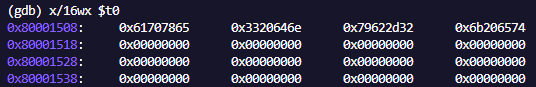  
*Estado inicial antes de aplicar los inner blocks pero sin sumarlo al original.*

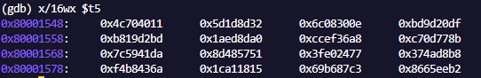  
*Estado después de completar los inner blocks (20 rounds).*

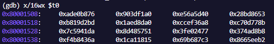  
*Estado final luego de sumar con el working_state, listo para generar el keystream.*

### Comprobación con la especificación oficial

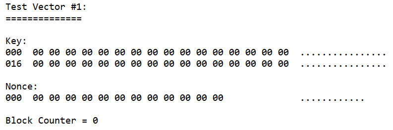  
*Estado inicial de la especificación.*

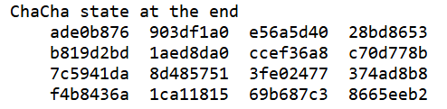  
*Estado final de la especificación.*


## Bitácora de un bug: Quarter Round sin guardar registros

Durante el desarrollo del algoritmo **ChaCha20 en RISC-V ASM**, se presentó un **bug crítico** en la función `quarter_round`:

### Descripción del error

La función `quarter_round` **se ciclaba indefinidamente** al ejecutarse varias veces en la prueba de ChaCha20.  
Esto ocurría porque **la dirección de retorno (`ra`) y los registros callee-saved (`s1-s4`) no se guardaban en el stack** antes de realizar llamadas a funciones internas (`rotate_left`).  
Como consecuencia:

- La función `rotate_left` sobrescribía `ra` y los registros `s`.  
- Al retornar de `quarter_round`, la CPU saltaba a una dirección incorrecta, causando un loop inesperado o comportamiento indefinido.

#### Código afectado (antes de la corrección):

```ASM
.globl quarter_round
quarter_round:

    ...

    ret

```
### Cómo se detectó:

Se utilizó GDB para inspeccionar los registros durante la ejecución:

Se colocó un breakpoint al inicio de quarter_round.

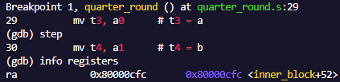  
*Direccion de retorno al entrar a quarter_round.*


Se observó que después de la primera llamada a rotate_left, el registro ra ya no contenía la dirección de retorno esperada.


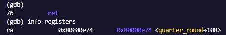  
*Direccion de retorno antes de salir de quarter_round.*

Como resultado el programa terminaba congelado sin poder avanzar.


  
*Programa congelado.*

### Solución aplicada

Se corrigió guardando ra y los registros callee-saved (s1-s4) en el stack al inicio de la función y restaurándolos antes de retornar.

```ASM
.globl quarter_round
quarter_round:
    addi sp, sp, -20
    sw ra, 16(sp)
    sw s1, 12(sp)
    sw s2, 8(sp)
    sw s3, 4(sp)
    sw s4, 0(sp)

   ...

    # Restauración de registros
    lw s4, 0(sp)
    lw s3, 4(sp)
    lw s2, 8(sp)
    lw s1, 12(sp)
    lw ra, 16(sp)
    addi sp, sp, 20
    ret
```

Como resultado las direcciones de retorno se guardan correctamente:

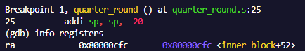  
*Direccion de retorno al entrar a quarter_round.*

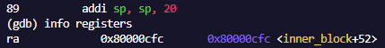  
*Direccion de retorno antes de salir de quarter_round (Corregido).*


## Resultados obtenidos

Se logró implementar el algoritmo **ChaCha20** para realizar el proceso de cifrado completamente en **ensamblador RISC-V**, utilizando el lenguaje **C únicamente como una interfaz** para definir constantes, preparar los datos de entrada y mostrar los resultados en consola. Esta separación permitió mantener la lógica criptográfica en ASM mientras C se encargó de la interacción con el usuario y la visualización de datos.

Durante el desarrollo del proyecto se adquirió un mayor entendimiento sobre el funcionamiento de las **operaciones en ensamblador**, especialmente en aspectos como las **convenciones de llamada**, la **preservación de registros y direcciones de retorno**, y el uso de distintos **modos de direccionamiento para acceder a memoria y registros**.

Además, el uso de **Docker** permitió crear un entorno de desarrollo reproducible e independiente del sistema operativo del dispositivo, lo que facilita la ejecución del proyecto en distintos equipos sin necesidad de configuraciones adicionales. Por otra parte, el uso de **GDB** resultó fundamental para el proceso de depuración, ya que permitió observar el estado de los registros y la memoria, así como ejecutar el código paso a paso para analizar el comportamiento del programa en ensamblador.

### Imagenes del algoritmo y sus resltados:


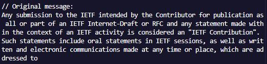  
*Mensaje Original.*

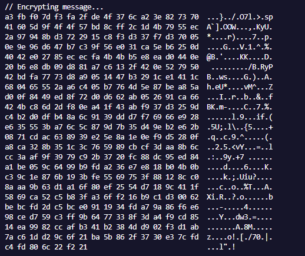  
*Mensaje Encriptado.*

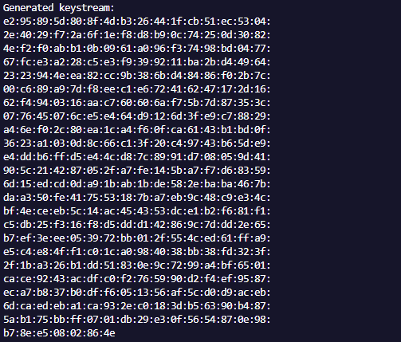  
*Ketstream generado.*

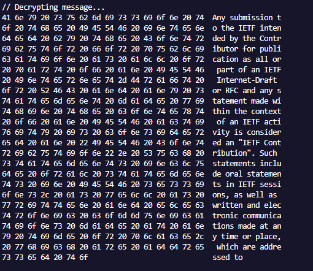  
*Mensaje Desencriptado.*
